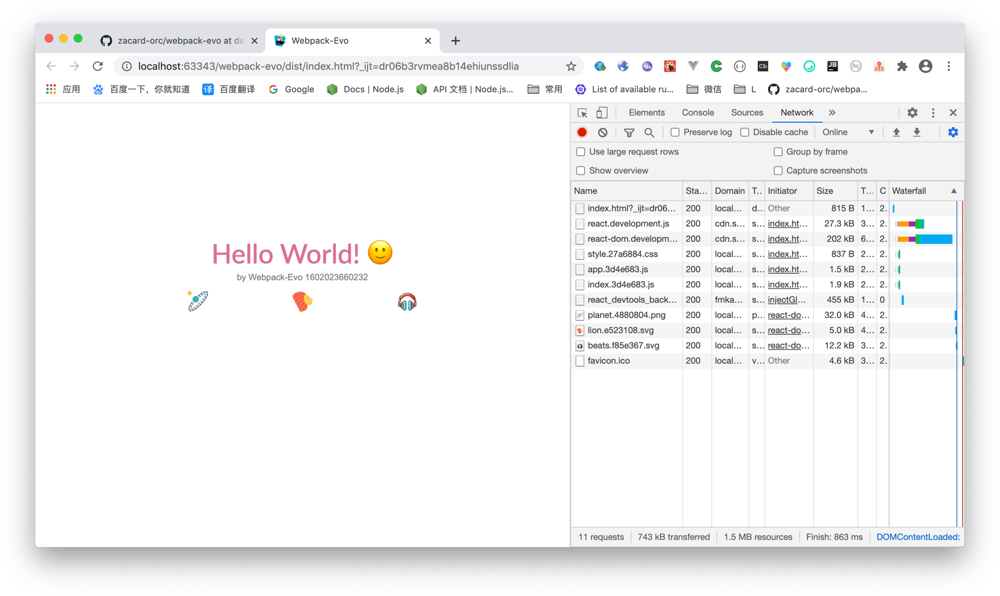

# webpack-evo
This is a webpack configuration record how to construct a react project and not use cra.  
This may help you to inspect details of knowledge

 

# How to use
```bash
git clone --depth 1 --single-branch --branch main https://github.com/zacard-orc/webpack-evo.git 
yarn
yarn dev
yarn build
```

# Env
```bash
React 16.13
Babel/core 7.11
Webpack 4.41
```

# Thanks


# ChangeLog/Tags
## v0.1.0  [⬇️](https://github.com/zacard-orc/webpack-evo/releases/tag/v0.1.0)
- :pushpin: init support 
- :bookmark: accelerate pack
- :bookmark: ccs/scss module
- :bookmark: some babel features may used in next tags
- :bookmark: default splitChunks
- :label: careless webpack dev/prd

## v1.0.0  [⬇️](https://github.com/zacard-orc/webpack-evo/releases/tag/v1.0.0)
- :pushpin: normal slimming
- :bookmark: use dev/prd config
- :bookmark: use externals for react


## v1.1.0 [⬇️](https://github.com/zacard-orc/webpack-evo/releases/tag/v1.1.0)
- :pushpin: normal slimming
- :bookmark: use font
- :bookmark: use img/svg loader
- :bookmark: copy public to dist


## v1.2.0 [⬇️](https://github.com/zacard-orc/webpack-evo/releases/tag/v1.2.0)
- :pushpin: normal slimming
- :bookmark: use css file
- :bookmark: adjust output hash length
