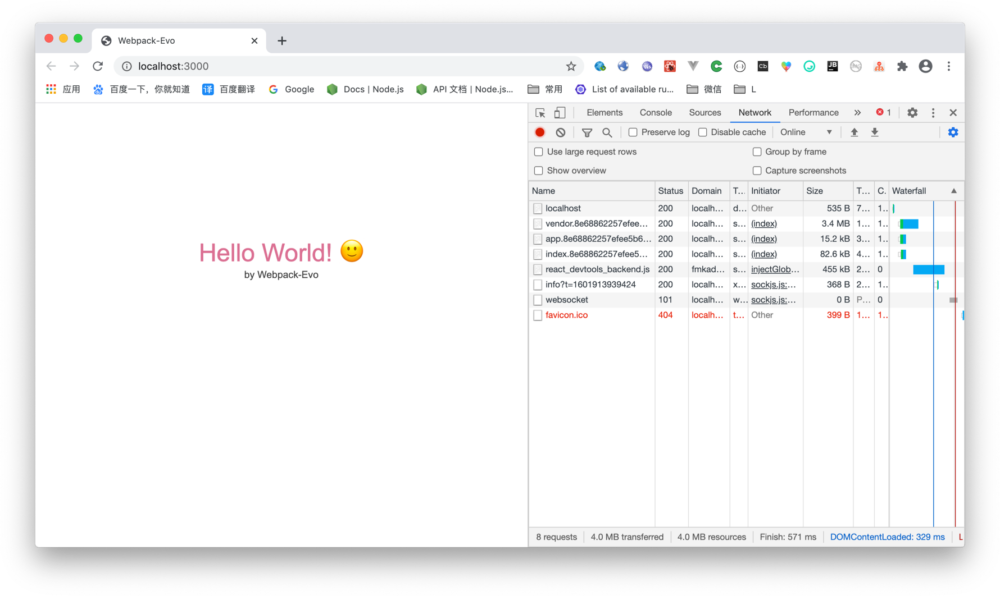

# webpack-evo
This is a webpack configuration record how to construct a react project and not use cra.  
This may help you to inspect details of knowledge

 

# How to use
```bash
git clone --depth 1 --single-branch --branch main https://github.com/zacard-orc/webpack-evo.git 
yarn
yarn dev
yarn build
```

# Env
```bash
React 16.13
Babel/core 7.11
Webpack 4.41
```

# Thanks


# ChangeLog
## 0.1.0
```markdown
- :pushpin: init support 
- :bookmark: accelerate pack
- :bookmark: ccs/scss module
- :bookmark: some babel features may used in next tags
- :bookmark: default splitChunks
- :label: careless webpack dev/prd
```

